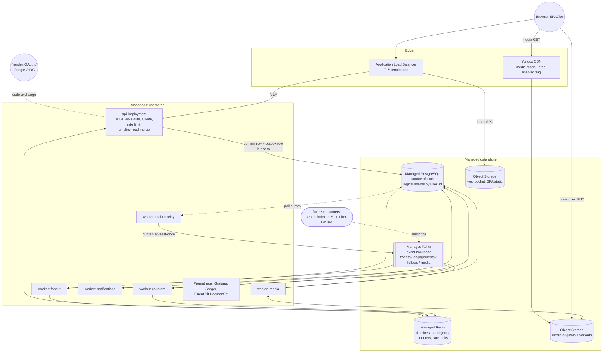

# Twitter-like Demo — One Architecture, Two Sizes

> **Core principle:** the demo is a scaled-down *instance* of the production architecture, never a different architecture. Component graph, service boundaries, API contracts, event schemas, and data models are identical. Demo and production differ only in instance sizes, replica counts, partition/shard counts, managed-service tiers, and feature flags. Production is `prod.tfvars`, not a rewrite.

## Assumptions

1. **Language: Go** — single static binary, low memory footprint (matters for demo cost), first-class Kafka/OTel/pgx clients. Not mandated by the brief; flagged as a choice.
2. **One region (ru-central1)**, 3 AZs in production, AZ `ru-central1-a` in demo. No multi-region DR in scope.
3. **Celebrity threshold** is a config value: **50 followers in demo** (demonstrable with 1k seeded users), 10,000 in production.
4. **Cost figures** are order-of-magnitude estimates at mid-2026 YC list prices in ₽; verify against the current calculator before committing.
5. Image media only (JPEG/PNG/WebP ≤ 5 MB), max 4 per tweet; no video.
6. Notifications are in-app (pull API + unread counter); no push/email delivery in MVP, but the event exists for a future push consumer.
7. Team operates Kubernetes already; no constraint pushing us to serverless.
8. "Retweet" is modeled as a tweet row with `retweet_of_id` set — it flows through the same write/fan-out path as a tweet (one code path, not two).
9. Social login: **Yandex OAuth is required; Google is optional** — Google is enabled purely by config when credentials exist.

---

## 1. High-Level Architecture

### 1.1 Shape: modular monolith, two deployable units

**Decision: one Go codebase (modular monolith) built into one container image, deployed as two units:**

- **`api`** — stateless HTTP service (all REST endpoints, auth, timeline reads, write acks).
- **`worker`** — the transactional-outbox relay plus Kafka consumers (fan-out, counters, notifications, media processing), role-selected by `WORKER_ROLES` env so the demo runs one pod consuming everything while production runs dedicated per-role Deployments scaled independently.

Why not microservices: at MVP scope, service boundaries would multiply images, pipelines, and network hops with zero scaling benefit — both demo and production scale by replicating the *same* stateless units. Why not a pure single-process monolith: read/write API latency must not compete with fan-out batch work for CPU, and consumer scaling (by partition count) is a different axis than HTTP scaling (by RPS). Two units is the minimum that scales on both axes.

**Extraction safety:** internal module boundaries (`auth`, `users`, `tweets`, `timeline`, `notifications`, `media`) communicate only via Go interfaces + Kafka events with protobuf schemas. If `timeline` ever needs to be its own service, the Kafka contract and REST contract are already the seams — no contract changes, only a deployment change.

### 1.2 API style

- **External: REST/JSON** with an OpenAPI 3.1 spec as the source of truth (codegen for server stubs and the k6/seed clients). REST because the consumers are browsers/mobile and the demo needs trivially curl-able endpoints; gRPC-web adds gateway machinery for no benefit at this scope.
- **Internal: no synchronous RPC at all.** Modules call each other in-process; cross-cutting async work goes over Kafka with **protobuf** event schemas. This deliberately removes the "internal gRPC mesh" failure domain. If a module is extracted later, its in-process interface becomes a gRPC service generated from proto — the protos are written in Phase 0 precisely so this is mechanical.

### 1.3 Component diagram (identical graph in demo and production)



The dashed "future consumers" box is the extension point: search, recommendations, and DMs attach as new consumer groups on existing topics — no producer changes.

### 1.4 Web client — thin SPA, zero new compute

**Stack: Vite + React + TypeScript**, TanStack Query for data fetching/pagination cache, API client **generated from the T0.2 OpenAPI spec** (orval) — the contract stays the single source of truth. Why: static-only build output (no SSR server to run), minimal build configuration, and the largest ecosystem/agent familiarity. Rejected: htmx/server-templates (needs server rendering = new compute, breaking "static files only"); SvelteKit/Next (drag toward SSR and heavier build machinery for zero benefit at this scope).

**Serving (no new compute, same pattern as media):** built assets live in an Object Storage `web` bucket with static-website hosting (error document → `index.html` for client-side routing). The existing ALB on `app.{domain}` routes by path:

- `/v1/*` → api pods
- everything else → `web` bucket

Same-origin API means **no CORS configuration and the `SameSite=Strict` refresh cookie works unchanged**. Demo vs production: production enables CDN in front of the static route (`cdn_enabled` — hashed assets get long cache, `index.html` no-cache); bucket layout, paths, and the API origin model are identical. A values/tfvars difference only.

---

## 2. Key Design Decisions

### 2.1 Timeline delivery — hybrid fan-out (chosen)

| Option | Read cost | Write cost | Celebrity behavior | Verdict |
|---|---|---|---|---|
| Fan-out-on-read | O(followees) queries per timeline read — kills the 100:1 read-heavy profile | Cheap | Fine | Rejected: cannot meet 10k RPS reads / P99 300ms |
| Fan-out-on-write | O(1) read from Redis | O(followers) per tweet — a 5M-follower tweet = 5M Redis ops | Catastrophic | Rejected alone |
| **Hybrid** | O(1) + small merge | Bounded by threshold | Celebrities excluded from fan-out; merged at read | **Chosen** |

**Mechanism (runs end-to-end in the demo):**

- On tweet write, `api` persists the tweet **and its `TweetCreated` outbox row in one PG transaction** (§2.4); the relay publishes to Kafka. Ack returns immediately (**write ack P99 < 500ms** is decoupled from both Kafka and fan-out).
- `worker:fanout` consumes, loads follower IDs in pages of 1,000. If `author.followers_count < CELEBRITY_THRESHOLD`, it `LPUSH`es `(tweet_id)` into each follower's Redis timeline list (`tl:{user_id}`, capped via `LTRIM` to 800 entries). Authors over the threshold are **skipped** — their tweets are *not* fanned out.
- Timeline read: fetch `tl:{user_id}` page from Redis, fetch the reader's **followed celebrities** (cached set, small by construction), pull each celebrity's recent tweet IDs from a per-author cache `utl:{author_id}` (their own profile timeline, also in Redis), **merge by Snowflake ID** (time-ordered, so merge is a k-way merge on int64), hydrate tweet bodies from cache/DB.
- Redis timeline lists are a **cache, not truth**: on miss (eviction, new user), the timeline is rebuilt fan-out-on-read style from Postgres and re-cached. This is also the graceful-degradation path if the fan-out consumer lags.
- **Demo demonstration:** threshold=50; seed script creates ~5 "celebrities" with 100–500 followers, so both paths and the merge are exercised under k6 and visible in traces.

Demo-cheap / prod-capable: ✅ — identical code; only the threshold, Redis size, partition count, and fanout-worker replica count change.

### 2.2 Primary datastore — Managed PostgreSQL with application-level sharding

**Options:** (a) YDB — serverless, natively sharded, but exotic query semantics, weaker ecosystem (migrations, ORMs, local dev), and would dominate design effort; (b) **Managed PostgreSQL with app-level sharding by `user_id`** — boring, fully understood, local-dev identical (same Postgres in docker-compose), and proven at this scale (Instagram-style logical sharding). **Chosen: (b).**

**Sharding strategy (logic present in demo, cardinality 1):**

- Shard key: **`user_id`** for `users`, `follows` (by follower), `likes` (by user), `notifications`, `identities`. **`author_id`** for `tweets` (a user's tweets colocate — profile timeline is single-shard).
- Routing: `shard = hash(key) % N_LOGICAL_SHARDS` (fixed at **256 logical shards** forever) → shard map config `logical → physical cluster DSN`. Demo: all 256 map to one cluster. Production: remap groups of logical shards to new physical clusters by copy-and-cutover — **no code change, no rehash**.
- Cross-shard reads (hydrating timeline tweets from many authors) are batched per physical shard; in the demo that degenerates to one query, but the batching code path exists and is tested.
- Global uniqueness (username, email, `(provider, provider_user_id)`) lives in small **global lookup tables** routed by one mechanism.

**Schema sketch (key tables):**

```
users        (id BIGINT pk, username citext uniq, email citext uniq,
              pass_hash NULL /* OAuth-only accounts */, bio, avatar_key,
              followers_count INT, following_count INT, created_at)
identities   (user_id BIGINT, provider TEXT, provider_user_id TEXT,
              email citext, created_at,
              PK(user_id, provider), UNIQUE(provider, provider_user_id))
follows      (follower_id, followee_id, created_at, PK(follower_id, followee_id))
              -- sharded by follower_id; reverse edge maintained via FollowChanged
              -- event into followers(followee_id, follower_id) sharded by followee_id
tweets       (id BIGINT pk /*snowflake*/, author_id, text VARCHAR(280),
              retweet_of_id BIGINT NULL, media JSONB, created_at,
              likes_count INT, retweets_count INT)   -- counters denormalized
likes        (user_id, tweet_id, created_at, PK(user_id, tweet_id))
notifications(id BIGINT, user_id, kind, actor_id, subject_id, created_at, read_at)
idempotency  (key UUID pk, user_id, response_hash, expires_at)
refresh_tokens(id, user_id, token_hash, expires_at, revoked_at)
outbox       (id BIGINT pk /*snowflake = publish order*/, topic, key, payload BYTEA,
              created_at, published_at NULL)
              -- written in the SAME tx as the domain row; relay publishes to Kafka
              -- and batch-deletes; lives on the same shard as its domain write
```

The duplicated `followers` edge table (write amplification ×2 on follow) is the price of making *both* "who do I follow" and "who follows X" single-shard queries — required for fan-out at scale, present in the demo.

### 2.3 Caching (Managed Redis)

| Key | Content | TTL | Invalidation |
|---|---|---|---|
| `tl:{uid}` | home timeline, list of tweet IDs, cap 800 | none (LRU) | append-on-fanout; rebuild on miss |
| `utl:{uid}` | user's own tweet IDs (profile + celebrity merge source), cap 200 | none (LRU) | append on tweet write |
| `tw:{id}` | serialized tweet | 1h | delete on tweet delete; counters read separately |
| `usr:{id}` | profile | 15m | delete-on-write |
| `cnt:{tweet_id}` | hash {likes, retweets} | 24h | incremented by counter worker (§2.7) |
| `celebs:{uid}` | set of followed celebrity IDs | 10m | delete on follow/unfollow of a celebrity |
| `rl:{uid\|ip}:{route}` | sliding-window rate-limit counters | window | natural expiry |
| `idem:{key}` | idempotent response (hot tier; Postgres is durable tier) | 24h | natural expiry |
| `oas:{state}` | OAuth state → PKCE verifier, redirect target (single-use) | 5m | consumed on callback |

**Hot-key mitigation** (a celebrity's `tw:{id}` during a viral moment): (1) in-process **singleflight** so each pod issues one concurrent rebuild per key; (2) small in-process LRU (~5k entries, 1–5s TTL) in front of Redis for `tw:` and `usr:` — bounds any single key to ~1 Redis read/sec/pod. **Stampede:** TTL jitter ±20% plus the same singleflight. Both mechanisms are in the demo code path (validated under k6), only the Redis tier changes for production.

### 2.4 Event backbone — Managed Kafka behind a transactional outbox

YDB Topics is cheaper at demo scale and Kafka-compatible-ish, but consumer-group semantics, tooling (lag exporters, schema discipline tooling, every team's prior knowledge), and exactly-the-same-API-in-prod favor real Kafka; the one-broker demo tier keeps cost acceptable. **Chosen: Managed Kafka.**

**Producing — transactional outbox; `api` never talks to Kafka.** A direct produce-after-commit has two flaws: a pod dying between PG commit and produce silently loses the event (timelines self-heal via rebuild-on-miss, but counters and notifications would diverge with no repair path), and a synchronous produce puts Kafka availability on the write path — fatal with the demo's 1-broker RF=1 tier. Instead:

- Every producer inserts the event into the `outbox` table **in the same PG transaction** as the domain write — atomicity is the database's, not ours.
- A **relay worker role** (fits the existing `WORKER_ROLES` mechanism; demo runs it in the single worker pod) polls `FOR UPDATE SKIP LOCKED` batches (defaults: 200ms interval, 500 rows — config), publishes to Kafka with the row's topic/key, marks rows published, and batch-deletes them after a short grace period to keep the table tiny.
- **At-least-once:** a crash between publish and mark re-publishes; consumers are already idempotent by `event_id`, so downstream semantics are unchanged. Per-aggregate ordering is preserved: rows publish in Snowflake-id order and the Kafka key keeps per-aggregate partition affinity.
- **Scaling:** one active relay per physical PG shard (advisory-lock leader election — same code, demo runs 1). At production's ~500 writes/s spread over 4 shards, a single poller per shard is loafing; relay count follows the shard map automatically.
- **Honest trade-offs:** (1) event availability gains up to one poll interval (~200ms median) — irrelevant against the 5s fan-out freshness budget; (2) outbox churn is a double write + delete per event — mitigated by batch deletes and fillfactor/autovacuum tuning in the migration, and validated under sustained k6 writes; (3) the relay is a new liveness dependency — covered by `outbox_lag_seconds` (age of oldest unpublished row) and `outbox_pending_rows` metrics with a page on lag > 30s, plus k8s restart.
- **Alternative considered — CDC (Debezium):** removes the poll latency and the double-write, but costs a Kafka Connect cluster (extra compute the demo can't justify), per-shard replication-slot management (a stalled slot blocks WAL recycling — a *worse* failure mode than a lagging poller), and multiplies operational surface during the future shard split. Rejected; revisit only if measured relay throughput ever becomes the bottleneck (it will not at 500 wps).

**Degradation story this buys:** Kafka fully down → writes keep succeeding, outbox absorbs events, timelines serve (staler) from cache with rebuild-on-miss; on recovery the relay drains and consumers catch up. No data loss, no write outage.

| Topic | Key (→ partition) | Producers → Consumers | Demo / Prod partitions |
|---|---|---|---|
| `tweets.v1` | `author_id` | relay → fanout, (future: search, ML) | 3 / 64 |
| `engagements.v1` (like/unlike/retweet) | `tweet_id` | relay → counters, notifications | 3 / 64 |
| `follows.v1` | `followee_id` | relay → notifications, graph maintenance | 3 / 32 |
| `media.v1` | `media_id` | relay → media worker | 1 / 8 |

- **Schema discipline:** protobuf, one `events/` proto package versioned in-repo, topic-name suffix `vN`; additive-only evolution, new major = new topic. (No schema registry in the demo; the proto package *is* the registry, enforced by CI compatibility check — same discipline scales to a registry later without changing payloads.)
- Keys guarantee per-author / per-tweet ordering, which the counter and fan-out logic rely on. **Partition scaling is online** (Kafka only adds partitions); keys re-hash, which is safe because no consumer assumes historical key→partition affinity — a constraint written into the contract docs in Phase 0.
- Consumers are idempotent (§2.7), giving effective exactly-once on at-least-once delivery.

### 2.5 Media — Object Storage + (flag-enabled) CDN

1. `POST /v1/media` → api validates type/size, allocates `media_id` (Snowflake), returns **pre-signed PUT URL** for `s3://media/orig/{media_id}` (5-min expiry) — uploads never transit the API pods.
2. Client PUTs, then `POST /v1/media/{id}/complete` → api verifies the object exists (HEAD), writes `MediaUploaded` to the outbox in the same transaction as the media-state update.
3. `worker:media` downloads, validates it's really an image, strips EXIF, renders `thumb/`, `feed/`, `orig/` WebP variants, writes them, marks media `ready` in PG. Tweets may reference only `ready` media.
4. **URL scheme fixed forever:** `https://media.{domain}/{variant}/{media_id}.webp`. Demo: that hostname is the ALB → Object Storage. Production: the same hostname moves to Yandex CDN with Object Storage origin. DNS/Terraform change only; zero stored-URL rewrites (DB stores `media_id`, never full URLs).

### 2.6 ID generation — Snowflake-style 64-bit

UUIDv7 is also time-sortable but is 128-bit, opaque to Redis ZSET/merge arithmetic, and bigger in every index. **Chosen: Snowflake** — `41b ms-timestamp | 10b worker | 12b sequence` as `BIGINT`. Time-ordering makes (a) the celebrity merge a trivial int64 k-way merge, (b) cursor pagination `WHERE id < cursor ORDER BY id DESC` index-only, (c) reverse-chron free. Worker IDs leased from a Postgres `node_ids` table at startup (demo: 2 pods; prod: hundreds — same lease code). Sharding is unaffected since we shard by hash of user_id, not by ID ranges.

### 2.7 Counters — buffered write-behind with idempotent source of truth

Naive `UPDATE tweets SET likes_count = likes_count+1` per like row-locks hot tweets to death at production load. **Chosen path (in demo):**

1. Like API writes the `likes` row (truth, idempotent via PK `ON CONFLICT DO NOTHING`) and inserts `EngagementEvent{event_id}` into the outbox — one transaction, so the event can never be lost.
2. `worker:counters` consumes, dedupes by `event_id` (Redis SETNX, 24h), `HINCRBY cnt:{tweet_id}`, and accumulates deltas in memory; every 2s (or 500 events) flushes `UPDATE ... SET likes_count = likes_count + Δ` batched per tweet — collapsing N likes into 1 row write.
3. Reads take `cnt:` from Redis, fall back to the PG column. A nightly reconcile job (`SELECT count(*) FROM likes ...` for recently-hot tweets) corrects drift — acceptable because counters are explicitly eventual.

### 2.8 Auth — JWT access + rotating opaque refresh; OAuth as identification front-end

Sessions in Redis would put a Redis round-trip in front of *every* read at 10k RPS and make Redis availability = auth availability. **Chosen:** 15-min **EdDSA-signed JWT** access tokens verified statelessly in the api pods; 30-day opaque refresh tokens, hashed in PG, **rotated on every use** with reuse-detection (revokes the family — mitigates token theft). Revocation latency is bounded by the 15-min access TTL, acceptable for this product. Keys in Lockbox, `kid` header for rotation.

**Social login (Yandex required, Google optional).** OAuth is an alternative *identification* front-end to the same internal session model: providers authenticate the user, we still issue our own JWT + refresh pair. Provider tokens are never used to authorize API calls — they are exchanged at the boundary, used once to fetch the profile, and discarded. One authorization model for the whole platform; adding VK/Apple later is a config entry + small adapter.

- **Flow:** Authorization Code **with PKCE** for both providers (Google is full OIDC — verify the `id_token`; Yandex is plain OAuth 2.0 — fetch profile from `login.yandex.ru/info`). PKCE even for the confidential server client: free defense-in-depth, and required anyway if a mobile client later does the dance natively.
- **Provider abstraction:** Go `OAuthProvider` interface (`AuthURL`, `Exchange`, `FetchIdentity`) with two implementations. Enabled providers are a **config list** (`auth.oauth.providers: [yandex]` minimum, `[yandex, google]` when Google creds exist). `GET /v1/auth/providers` lets clients render only configured buttons.
- **Endpoints:**
  - `GET /v1/auth/oauth/{provider}/start` → 302 to provider with `state` + PKCE challenge; `{state → verifier, redirect_target}` in Redis (`oas:{state}`, TTL 5 min, single-use).
  - `GET /v1/auth/oauth/{provider}/callback?code&state` → validate/consume state, exchange code, fetch identity, upsert user, issue the standard token pair (same response shape as `POST /login`).
  - `POST /v1/auth/oauth/{provider}/link` / `DELETE .../link` — link/unlink a provider on an authenticated account.
- **Linking rules (account-takeover-resistant):**
  1. `(provider, provider_user_id)` exists → log that user in.
  2. Else if provider email matches an existing user → **no silent auto-link**. Auto-link only if the provider asserts the email verified (Google `email_verified=true`; Yandex `default_email` is Yandex-verified by construction) **and** the link is audit-logged + a notification is sent ("Yandex login was linked to your account"). Unverified email → require login-then-link via the explicit `link` endpoint.
  3. Else → create a new user; username auto-derived from provider login with collision suffix.
- OAuth-born sessions have **identical** refresh rotation/reuse-detection semantics — one revocation story. OAuth-only accounts have `pass_hash NULL`; password endpoints reject them with a clear error.

### Consistency model per endpoint

| Endpoint | Model |
|---|---|
| `POST /tweets`, `POST /likes`, follow/unfollow | Strong on ack — domain row **and** its event are committed atomically (outbox); side effects async, guaranteed at-least-once |
| `GET /me`, own profile after edit | Read-your-writes (cache deleted on write, PG primary read) |
| Home timeline | Eventual, target staleness < 5s (fan-out lag SLO) |
| Profile timeline | Eventual ≤ replication lag; author sees own via `utl:` append |
| Counters | Eventual, ±seconds; reconciled nightly |
| Notifications | Eventual, < 30s |

---

## 3. Yandex Cloud Topology

One mapping table — the **architecture column never changes**, only sizing:

| Component | YC service | Demo sizing | Production sizing |
|---|---|---|---|
| Compute | Managed Service for Kubernetes | zonal master; 1 node group: 2× preemptible `s2.small` (2 vCPU/8 GB), 1 AZ | regional master; 3 node groups across 3 AZs, non-preemptible, autoscale 6→30 nodes (`s2.large`) |
| API pods | k8s Deployment | 2 replicas, HPA max 4 | 20–60 replicas, HPA on RPS+CPU |
| Workers | k8s Deployments | 1 pod, all roles | per-role Deployments, fanout ≈ partition count |
| OLTP | Managed PostgreSQL | 1× `b2.medium` (burstable), 1 host, 30 GB SSD | per physical shard: `s3.large`, 3 hosts (1 primary + 2 sync/async replicas across AZs), 1 TB; 4 shards initially |
| Cache | Managed Redis | `b2.medium`, 1 host, no persistence | `s3.medium` sharded cluster (6 shards × 3 replicas across AZs) |
| Events | Managed Kafka | 1 broker `s2.micro`, 32 GB, RF=1 | 3+ brokers `s3.medium` across 3 AZs, RF=3, min.insync=2 |
| Media | Object Storage | 1 bucket, standard | same bucket; lifecycle to cold for originals |
| Web SPA | Object Storage static website | `web` bucket served via ALB path route | same bucket behind CDN (`cdn_enabled`); hashed-asset long cache |
| CDN | — / Yandex CDN | flag off (ALB serves `media.` host) | flag on, same hostname → CDN origin |
| LB | Application Load Balancer | 1 listener, 1 AZ | listeners in 3 AZs, same config module |
| Network | VPC | 3 subnet sets **declared** for 3 AZs; `az_count=1` instantiates one | `az_count=3` |
| Secrets | Lockbox + KMS (incl. OAuth client secrets) | same structure | same structure, + key rotation schedule |
| IAM | per-workload service accounts (api: S3 sign + Lockbox read; workers: S3 rw; CI: deploy-only) | identical | identical |
| Logs/metrics | in-cluster Prometheus/Grafana/Jaeger + Fluent Bit → Object Storage | retention 3d | retention 30d, Prometheus remote-write to Mimir/VictoriaMetrics, or Yandex Monitoring sink added |

**Why Managed K8s and not Serverless Containers:** serverless containers can't host the long-running Kafka consumer group model, DaemonSet log collection, or the in-cluster observability stack the same way — we'd end up with *two* architectures. K8s runs identically at 2 nodes and 30 nodes; the demo pays for it with preemptible nodes.

**Demo monthly cost (estimate, ₽):** k8s master ~6k + 2 preemptible nodes ~3k + PG b2.medium ~3.5k + Redis b2.medium ~2.5k + **Kafka 1 broker ~5k** + ALB ~2.5k + NAT/IP/S3/egress ~2k ≈ **₽24–28k/мес (~$250–290)**. Kafka and the k8s master dominate; that is the price of "no architecture swap."

**Top-3 production cost drivers:** (1) PG shard clusters with HA replicas, (2) k8s node groups, (3) cross-AZ + CDN egress traffic.

---

## 4. Demo → Production Promotion Plan

| Component | What changes (tfvars / Helm values) | Guaranteed identical |
|---|---|---|
| VPC | `az_count: 1→3` | subnet CIDR plan, route tables module, SG rules |
| K8s | master `zonal→regional`; node group sizes/counts; `preemptible: false`; HPA max | manifests, images, probes, pod specs |
| PostgreSQL | host count 1→3; tier; `physical_shards: 1→4` + shard-map values | schema, migrations, queries, 256-logical-shard routing code |
| Redis | tier; `sharded: true`; replicas | every key name, TTL, eviction policy semantics |
| Kafka | brokers 1→3; RF 1→3; per-topic partitions (e.g., `tweets.v1: 3→64`) | topic names, proto schemas, keys, consumer group IDs |
| Outbox relay | poll interval / batch size; relay count follows `physical_shards` | outbox schema, relay logic, per-aggregate ordering contract |
| Frontend (SPA) | `cdn_enabled` for static route; asset cache TTLs | build pipeline, bucket layout, serving paths (`/` static, `/v1/*` api), same-origin model |
| Timeline | `celebrity_threshold: 50→10000`; fanout replicas | hybrid algorithm, merge code, rebuild path |
| Media/CDN | `cdn_enabled: false→true` | URL scheme, bucket layout, pre-sign flow |
| OAuth | provider list, Lockbox secret IDs, registered redirect URIs (test vs prod OAuth apps) | flow code, `identities` schema, linking policy |
| Rate limits / idempotency | numeric limits | enforcement code, key formats |
| Observability | retention, sampling `1.0→0.05+tail`, SLO thresholds | dashboards, alert rule templates, log schema |

**Ordered promotion steps:**

1. `az_count=3` — new subnets, regional ALB listeners (*online*).
2. Regional k8s master + 3 node groups; drain demo group (*online, rolling*).
3. PG: add 2 HA hosts, upgrade tier (*brief failover blip — maintenance window*).
4. Redis → sharded cluster (*new cluster + warm-up; timeline cache rebuilds itself — online by design*).
5. Kafka → 3 brokers RF=3 (*online*), then raise partition counts (*online; key re-hash is contractually safe per §2.4*).
6. Raise HPA ceilings, split worker roles into dedicated Deployments (Helm values only).
7. Split PG to 4 physical shards: logical-shard group copy (logical replication) → cutover via shard map (*per-group maintenance moment, seconds of write pause per group*). Each new physical shard automatically brings its own outbox relay — relay count follows the shard map.
8. Enable CDN flag; flip thresholds/limits to prod values; switch OAuth apps/redirect URIs to prod.
9. Re-run the same k6 suite at production targets.

**Scale-only risks and how the demo already answers them:**

| Risk | Demo mitigation already in code | Pre-promotion validation |
|---|---|---|
| Hot Kafka partition (celebrity author key) | celebrities skip fan-out entirely — the hot path is capped | k6 scenario: 1 author at 30% of write traffic; watch partition lag |
| Cache stampede on Redis restart/eviction | singleflight + jittered TTL + timeline rebuild-on-miss | chaos test: `FLUSHALL` mid-load-test, P99 must recover < 60s |
| PG connection exhaustion at 60 api pods | PgBouncer (transaction pooling) deployed in demo from day one | connection-count dashboard under HPA scale-out test |
| Counter row-lock contention | buffered write-behind (§2.7) | k6 like-storm on one tweet |
| Fan-out lag for 10k-follower users | paged fan-out (1k/batch) + lag SLO + alert | seed one 5k-follower non-celebrity, measure `fanout_lag_seconds` |
| Kafka outage (demo RF=1; prod broker loss) | writes never touch Kafka — outbox absorbs, relay drains on recovery; no event loss by construction | chaos: stop Kafka 5 min under load; writes stay green, `outbox_lag_seconds` recovers < 5s after restart |
| Outbox table churn/bloat at 500 wps | batched delete-after-publish + fillfactor/autovacuum tuning in migrations | sustained k6 write run; watch dead tuples + `outbox_pending_rows` |

---

## 5. Observability (one stack, two retention/sampling configs)

- **Metrics:** Prometheus Operator + Grafana, RED per HTTP route and per consumer (rate/errors/duration), USE for nodes, plus domain metrics: `outbox_lag_seconds` / `outbox_pending_rows` (page on lag > 30s), `fanout_lag_seconds`, `timeline_cache_hit_ratio`, Kafka consumer lag (exporter), PgBouncer pool saturation. Dashboards: *API RED*, *Timeline pipeline* (produce→consume→fanout latency funnel), *Data plane* (PG/Redis/Kafka), *SLO burn*.
- **Logging:** structured JSON (zerolog) with `trace_id`, `request_id` (generated at ALB/api, propagated via headers and Kafka message headers), `user_id`, `shard`. Fluent Bit DaemonSet → Object Storage (3d demo / 30d prod). Never log tokens/PII bodies.
- **Tracing:** OpenTelemetry SDK across HTTP server/client, pgx, Redis, and **Kafka produce→consume context propagation** — a single trace covers tweet-write → fan-out → timeline visibility. Backend: Jaeger (in-cluster, S3-backed) in both sizes. Sampling: 100% demo; production parent-based 5% + tail-sampling of errors/slow.
- **Probes:** liveness = process health only (never dependencies — avoids restart storms); readiness = PG/Redis ping + Kafka client state, so k8s gates traffic during rollouts and isolates pods with broken connectivity. Workers expose readiness on consumer-group membership.

**SLOs (thresholds env-parameterized; alert rules templated once):**

| SLO | Demo / Prod target | SLI | Alerting |
|---|---|---|---|
| Timeline read latency | P99 < 300ms (both) | histogram on `GET /v1/timeline` | multi-window burn rate (5m/1h fast, 6h/3d slow) |
| Tweet write ack | P99 < 500ms (both) | `POST /v1/tweets` | same pattern |
| API availability | 99% demo / 99.9% prod | non-5xx ratio | burn-rate |
| Fan-out freshness | < 5s p95 (both) | `fanout_lag_seconds` (tweet commit → timeline visible; includes outbox relay hop) | threshold + burn |
| Timeline cache hit ratio | > 90% / > 98% | hit/(hit+miss) | warning only |

---

## 6. Deployment & Operations

- **CI/CD (GitHub Actions):** lint+vet → unit tests → integration tests (testcontainers: PG/Redis/Kafka) → build single image → Trivy scan (fail on high) → push to YC Container Registry → `helm upgrade` to demo on main-merge. Rolling updates (`maxUnavailable: 0`) in demo; the chart already carries an Argo Rollouts-compatible canary structure (weights as values) so production canary is a values change.
- **IaC:** Terraform, **one module set** (`network`, `k8s`, `pg`, `redis`, `kafka`, `storage-cdn`, `iam-lockbox`, `alb`) consumed by one root, parameterized solely by `demo.tfvars` / `prod.tfvars`. State in Object Storage with YDB-table locking. Helm: one chart, `values-demo.yaml` / `values-prod.yaml`.
- **Migrations:** golang-migrate, run as a Helm pre-install/pre-upgrade Job. Discipline: expand → migrate → contract; every migration must be compatible with the previous app version (enforced in review checklist); migrations are applied per-logical-shard-set so the future 4-shard split reuses the same runner.
- **Scaling:** HPA on api (CPU + RPS via Prometheus adapter, low demo thresholds so HPA behavior is *observed* in the demo); worker replicas ≤ partitions (KEDA on consumer lag is a values-file addition, structure present); **PgBouncer runs in the demo** — connection-limit behavior must be tested at small scale, not discovered at large.
- **Backups/DR:** demo — daily automatic PG backup, 7d. Production — PITR (WAL), **RPO ≤ 5 min, RTO ≤ 30 min** via cross-AZ failover; Redis is rebuildable cache by design (its loss = degraded latency, not data loss); Kafka RF=3; S3 versioning.
- **Local dev:** docker-compose with the *same graph* — Postgres, Redis, Kafka (single KRaft broker), MinIO (S3 API; the app uses the S3 SDK against an endpoint variable, so this is config, not a component swap), Jaeger, mock OIDC/OAuth server for social-login dev. `make seed && make up` gives a working timeline locally; the Vite dev server proxies `/v1` to the compose api — the same same-origin model as deployed.

---

## 7. Security Baseline

- **AuthN/AuthZ:** flow per §2.8 — EdDSA JWTs, 15-min access / 30-day rotating refresh with reuse-detection; refresh delivered as `HttpOnly; Secure; SameSite=Strict` cookie for web, body for mobile. Authorization is ownership checks in handlers (no roles needed in MVP; claim structure leaves room).
- **OAuth hardening:** `state` single-use, Redis-expiring, bound to the PKCE verifier (covers CSRF and code injection); callback enforces exact-match registered `redirect_uri`; provider client secrets in Lockbox; rate-limit `start`/`callback` per IP; uniform errors (no leaking whether an email/identity exists); verified-email-only auto-link with audit log + user notification.
- **Rate limiting:** two layers — ALB-level connection limits, and application sliding-window in Redis per user (writes: e.g. 30 tweets/h) and per IP (auth endpoints: brute-force protection), returning 429 + `Retry-After`. Limits are config. Idempotency-Key required on all mutating endpoints (24h dedupe window).
- **OWASP:** parameterized queries only (pgx, no string SQL); strict input validation generated from OpenAPI constraints; output encoding + CSP on any served HTML; media worker re-encodes images (kills polyglot-file payloads) and strips EXIF GPS; pre-signed URLs scoped to exact key + content-length-range; password hashing argon2id; uniform auth errors (no user enumeration).
- **Network/secrets:** private subnets for all data services, SGs allow only k8s node group → data ports; pods egress via NAT; no public IPs except ALB. TLS at ALB, TLS to PG/Redis/Kafka (managed-service certs); Lockbox via External Secrets Operator — no secrets in env-files/git; per-workload IAM SAs (least privilege, §3). Same design both sizes.

---

## 8. Sub-Agent Task Decomposition (demo build)

Legend: ∥ = parallelizable within phase, ★ = critical path. Each task fits one focused agent session.

### Phase 0 — Contracts & scaffolding (everything else depends on these)

| ID | Title | Goal / Scope | Inputs | Outputs | Definition of Done | Deps |
|---|---|---|---|---|---|---|
| **T0.1 ★** | Repo scaffold + shared kit | Go monorepo layout (`cmd/api`, `cmd/worker`, `internal/{auth,users,tweets,timeline,notifications,media}`, `pkg/{log,otel,config,redisx,pgx,kafkax,snowflake,idem}`); config loading (env), zerolog JSON logger with trace/request IDs, OTel bootstrap, Snowflake generator w/ PG node lease, singleflight+LRU helper, sliding-window limiter, idempotency middleware skeleton; Makefile, CI workflow (lint/test/build/scan) | this document | compiling skeleton, green CI | `make test` green; binaries start; logger/OTel emit; unit tests for snowflake/limiter/singleflight | — |
| **T0.2 ★** | OpenAPI contract | Full OpenAPI 3.1 for all endpoints: auth (register/login/refresh/logout), **OAuth (providers discovery, start/callback per provider, link/unlink, nullable-password error case)**, tweets CRD, likes, retweets, follows, home+profile timelines (cursor pagination), notifications, media (presign/complete); error model, Idempotency-Key header, validation constraints | §1–2 | `api/openapi.yaml`, generated server stubs + Go client | spec lints (spectral); stubs compile; client used later by seed/k6 | T0.1 |
| **T0.3 ∥** | Event contracts | Protobuf for `tweets.v1`, `engagements.v1`, `follows.v1`, `media.v1` envelopes (event_id, occurred_at, trace ctx); topic/key/ordering contract doc incl. "no key→partition affinity" rule; buf CI compatibility gate | §2.4 | `proto/events/*`, generated Go, `docs/events.md` | buf lint+breaking pass in CI | T0.1 |
| **T0.4 ∥** | DB migrations + sharding kit | golang-migrate set for all §2.2 tables + indexes (cursor pagination, follower lookups), **incl. `identities`, global provider-identity lookup, nullable `pass_hash`, `outbox` (fillfactor/autovacuum tuned)**; `pkg/outbox` same-tx insert helper; 256-logical-shard router + shard-map config + per-shard batched query helper; repository interfaces | §2.2 | `migrations/`, `pkg/sharding` | migrations up/down clean on PG16; router unit-tested incl. multi-shard batching with a 2-entry fake map | T0.1 |
| **T0.5 ∥** | docker-compose + seed harness | Compose: PG, Redis, Kafka(KRaft), MinIO, Jaeger, **mock OIDC/OAuth server**; topic-creation init; `cmd/seed` skeleton (full data in T4.2) | T0.2–T0.4 | `docker-compose.yaml`, `make up/seed` | `make up` healthy from scratch; topics exist; migrations auto-applied | T0.1 |

### Phase 1 — Core domain (∥ after Phase 0)

| ID | Title | Goal / Scope | Inputs | Outputs | DoD | Deps |
|---|---|---|---|---|---|---|
| **T1.0 ★** | Outbox relay worker | Relay role per §2.4: `FOR UPDATE SKIP LOCKED` batched poll (200ms/500 rows, config), per-shard advisory-lock leadership, publish with row topic/key, mark + batched delete, `outbox_lag_seconds`/`outbox_pending_rows` metrics, trace-context propagation outbox→Kafka headers | T0.3, T0.4 | `worker:relay` | tests: crash between publish & mark → duplicate delivered, consumer dedupe holds; Kafka stopped 60s → zero write errors, full drain on recovery; per-aggregate order preserved | T0.3, T0.4 |
| **T1.1 ★** | Auth module | Register/login/refresh/logout per §2.8: argon2id, EdDSA JWT (kid, Lockbox-pluggable keys), rotating refresh + reuse-detection, auth middleware, per-IP limits on auth routes | T0.2, T0.4 | working auth endpoints | integration tests (testcontainers): full token lifecycle incl. reuse-detection revocation; rate-limit 429 test | T0.1–0.5 |
| **T1.2 ∥** | Users & follows | Profiles CRUD; follow/unfollow writing both edge tables + `FollowChanged` outbox row in one tx; follower/following counts; `celebs:{uid}` cache maintenance; user cache delete-on-write | T0.2–0.4 | endpoints + producer | tests: both edges consistent; idempotent double-follow; event emitted once per state change | T1.1 |
| **T1.3 ∥** | Tweets & retweets write path | `POST/DELETE /tweets` (retweet = `retweet_of_id`), 280-char + ready-media validation, Idempotency-Key enforcement (Redis+PG), `utl:` append, `TweetCreated`/`TweetDeleted` via outbox (same tx) | T0.2–0.4 | write path complete | tests: duplicate Idempotency-Key returns identical cached response, single row, single event | T1.1 |
| **T1.4 ∥** | Likes + counter pipeline | Like/unlike (idempotent PK), `EngagementEvent` via outbox (same tx); **counter worker**: event_id dedupe, HINCRBY, 2s/500-event batched PG flush; counter read-through; reconcile job | T0.3, T0.4 | api + `worker:counters` | test: 1000 like events for 1 tweet → ≤ N batch updates, exact final count, replayed events ignored | T1.1 |
| **T1.5 ∥** | Media pipeline | Presign/complete flow per §2.5; media worker: re-encode WebP variants, EXIF strip, `ready` flag; fixed URL scheme | T0.2, T0.3 | api + `worker:media` | integration vs MinIO: full upload→variants→ready; non-image rejected; URL scheme asserted in test | T1.1 |
| **T1.6 ∥** | OAuth providers (Yandex + Google) | `OAuthProvider` interface + Yandex/Google adapters; state/PKCE Redis flow; linking rules per §2.8 incl. verified-email policy, audit log + link-notification event; `providers` discovery endpoint; config-driven enablement (Google off without creds) | T0.2, T1.1 (reuses — never reimplements — session machinery) | OAuth endpoints + adapters | integration tests vs mock OIDC/OAuth container: new-user signup, repeat login, verified-email auto-link w/ audit+notification, unverified-email rejection, replayed/expired state rejection, disabled-provider 404; manual smoke vs real Yandex OAuth in demo env | T1.1 |
| **T1.7 ∥ [CORE]** | Web SPA foundation | Vite+React+TS scaffold per §1.4; TS client generated from `api/openapi.yaml` (orval) + TanStack Query wiring; auth screens: register/login, OAuth buttons driven by `GET /v1/auth/providers`, access-token-in-memory + refresh-cookie session handling; routing, error/loading/empty patterns; CI job: build + sync `dist/` to `web` bucket. Develops against an OpenAPI mock (prism) — **never blocks or waits on backend tasks** | T0.2 generated client | `web/` app + deploy job | reproducible CI build; Playwright smoke vs mock: register→login flow, OAuth buttons render per providers config; initial bundle < 300 KB gz | T0.2 |

### Phase 2 — Timelines & backbone (the heart)

| ID | Title | Goal / Scope | Inputs | Outputs | DoD | Deps |
|---|---|---|---|---|---|---|
| **T2.1 ★** | Fan-out worker | Consume `tweets.v1`; threshold check; paged follower fan-out `LPUSH+LTRIM`; skip celebrities; delete handling; `fanout_lag_seconds` metric; idempotent on redelivery | T1.0, T1.2, T1.3 | `worker:fanout` | tests: sub-threshold author lands in all follower lists; over-threshold author untouched; redelivery no-dup | T1.0, T1.2, T1.3 |
| **T2.2 ★** | Timeline read + hybrid merge | `GET timeline`: Redis page + celebrity `utl:` k-way Snowflake merge + hydration (singleflight/LRU) + cursor pagination; **rebuild-on-miss from PG** (multi-shard batched); profile timeline | T2.1 | the flagship endpoint | tests: merged order correct across paths; cold-cache rebuild equals warm result; pagination stable across inserts | T2.1 |
| **T2.3 ∥** | Notifications | Consume `follows.v1` + `engagements.v1` (+ OAuth link events) → notification rows; list + unread-count + mark-read endpoints; self-action suppression; dedupe | T1.2, T1.4 | `worker:notifications` + endpoints | tests: follow→notification; like→notification to author only; replay no-dup | T1.2, T1.4 |
| **T2.4 ∥ [CORE]** | Web SPA product screens | Home timeline w/ cursor pagination (infinite scroll), compose (text + image via presign→PUT→complete→ready poll), profile page + follow/unfollow, like/retweet with optimistic counter updates, notifications badge + list | T1.7, contracts of T2.2/T1.3/T1.5/T2.3 | complete clickable demo UI | Playwright e2e vs full compose stack: post tweet w/ image → appears in a follower's timeline; like updates counter optimistically + settles; pagination stable across new posts; OAuth login e2e via mock provider | T1.7, T2.2, T1.5, T2.3 |

### Phase 3 — Observability & infra (∥ with late Phase 2)

| ID | Title | Goal / Scope | Inputs | Outputs | DoD | Deps |
|---|---|---|---|---|---|---|
| **T3.1 ∥** | Terraform | Module set + root per §3/§6; 3-AZ subnet plan with `az_count` var; `web` bucket + ALB path routing (`/v1/*` → api, else static SPA); `demo.tfvars` **and** `prod.tfvars` both written now; state backend+lock; IAM/Lockbox least-privilege (incl. OAuth secrets) | §3 | `infra/` | `terraform validate` + `plan` clean with **both** tfvars; demo applies to a real YC folder | T0.1 |
| **T3.2 ∥** | Helm + CI/CD deploy | One chart (api, workers-by-role, migrations Job, PgBouncer, External Secrets, HPA, probes per §5); `values-demo/prod.yaml`; canary-ready rollout structure; GH Actions deploy job | T3.1 | `deploy/chart` | demo cluster runs full app; `helm template` with prod values renders valid manifests; rolling deploy with zero 5xx under light load | T3.1, T2.2 |
| **T3.3 ∥** | Observability stack | Prometheus Operator, Grafana + the 4 dashboards (§5) as code, Jaeger, Fluent Bit→S3, Kafka-lag & PgBouncer exporters; SLO recording + burn-rate alert rules templated with per-env thresholds; verify Kafka trace propagation end-to-end | T0.1 chart | manifests + dashboards-as-code | one trace visibly spans write→fanout→read; all dashboards populated; alert rules load with both env values | T3.2 |

### Phase 4 — Hardening, load, promotion-readiness

| ID | Title | Goal / Scope | Inputs | Outputs | DoD | Deps |
|---|---|---|---|---|---|---|
| **T4.1 ∥** | Abuse & limits hardening | Wire final rate-limit matrix (config), uniform error responses, security headers/CSP, pre-sign constraints audit, **OAuth callback abuse cases**, secret-scan + Trivy gates as required checks | T1.x | configs + tests | limiter tests per route class; ZAP baseline scan clean; CI gates enforced | T2.2, T3.2 |
| **T4.2 ★** | Seed + k6 suite | Seed: 1k users, realistic follow graph (Zipf), ~5 celebrities (>50 followers), 20k tweets; k6: 50 RPS timeline / 10 RPS writes mixed scenario + like-storm + celebrity-post scenario; thresholds = §5 SLOs. (OAuth excluded from load tests — covered by T1.6 integration suite; seeded users use password auth) | T0.5, generated client | `cmd/seed`, `k6/` | demo NFRs green in CI-runnable load job: P99 read <300ms, write <500ms, fanout p95 <5s, cache hit >90% | T2.2, T3.3 |
| **T4.3 ∥** | Chaos & degradation validation | Scripted: Redis flush mid-test (stampede), kill fanout worker (lag alert fires, timelines degrade gracefully via rebuild), **stop Kafka 5 min under load (writes stay green, outbox absorbs + drains)**, PG failover sim in compose; document observed behavior vs §4 risk table | T4.2 | `docs/chaos-report.md` | each scenario meets recovery criteria; alerts fired as designed | T4.2 |
| **T4.4 ★** | **Promotion-readiness audit** | Prove "two sizes, one architecture": `terraform plan -var-file=prod.tfvars` produces sizing/count-only diff; `helm template -f values-prod.yaml` diff shows replicas/resources/flags only; grep-audit that no code branches on environment name; checklist sign-off of §4 table; CI job that re-runs both renders on every PR | all | `docs/promotion-audit.md` + CI job | zero code/contract/schema diffs between sizes; both plans/renders valid; §4 ordered steps each mapped to a concrete variable change | T3.1, T3.2, T4.2 |

**Critical path:** T0.1 → T0.2 → T1.1 → (T1.2, T1.3) → T2.1 → T2.2 → T3.2 → T4.2 → T4.4. T1.0 must land before T2.1 but runs in parallel with T1.1.
**Maximum parallelism:** after T0.5, eight agents (T1.0–T1.7) can run concurrently against frozen contracts; T3.1 can start the moment T0.1 lands. The SPA tasks (T1.7, T2.4) sit off the backend critical path — the demo is *presentable* only after T2.4, but no backend task waits on the frontend.

### Tweet write path (demo == production)

```mermaid
sequenceDiagram
    participant C as Client
    participant A as api
    participant P as PostgreSQL
    participant K as Kafka
    participant F as worker:fanout
    participant R as Redis

    participant REL as worker:relay
    C->>A: POST /v1/tweets (JWT, Idempotency-Key)
    A->>R: idem check (SETNX)
    A->>P: BEGIN; INSERT tweet + INSERT outbox(TweetCreated); COMMIT
    A->>R: LPUSH utl:{author} + cache tweet
    A-->>C: 201 (P99 < 500ms — Kafka not on the ack path)
    REL->>P: poll outbox (SKIP LOCKED batch, ≤200ms)
    REL->>K: publish TweetCreated (key=author_id, at-least-once)
    REL->>P: mark published + batch-delete
    K->>F: consume
    alt followers < celebrity_threshold
        loop follower pages of 1000
            F->>P: SELECT follower_ids (followers table, page)
            F->>R: pipelined LPUSH tl:{follower} + LTRIM 800
        end
    else celebrity
        F->>F: skip — merged at read from utl:{author}
    end
```

---

The single deliberate trade-off running through everything: the demo pays ~₽25k/month for Kafka and Kubernetes it barely needs — that is the explicit cost of guaranteeing that production is `prod.tfvars`, not a rewrite. T4.4 exists to prove that guarantee mechanically rather than by assertion.
